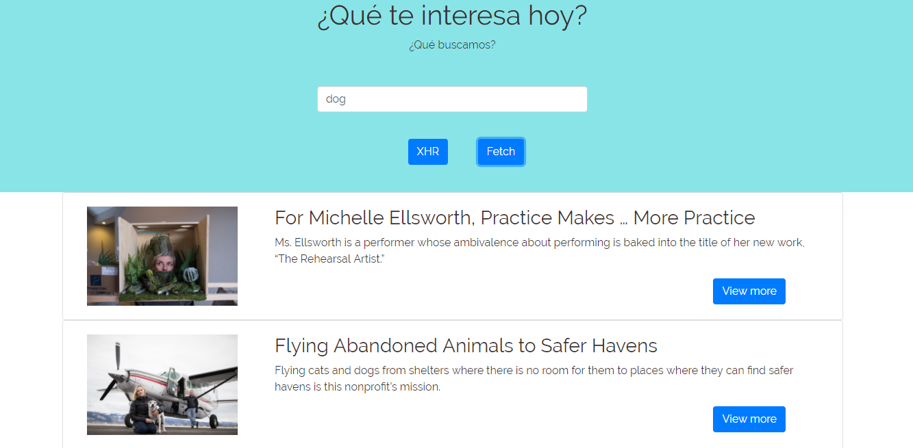

# XHR PROJECT DEMO
## Descripción
* Usar XHR para construir una aplicación.
* Para este ejercicio debemos hacer una petición a la página del NY Times y que con la respuesta podamos ocupar sus noticias.

##  Recursos utilizados

* HTML5
* CSS
* JQUERY
* Eslintrc 
* Bootstrap
* API NY Times 

## Autor

* Jymma Mogollon

## Archivos utilizados

* README.md con descripción del proyecto con la  API NY Times.
* index.html: Página web.
* .eslintrc con configuración para linter.
* .gitignore para ignorar node_modules u otras carpetas que no deban incluirse en control de versiones.
* package.json con nombre, versión, descripción, autores, licencia, dependencias, scripts (pretest, test, ...)

## Producto

## Licencia

*Copyright (C) 2018 ~ *
